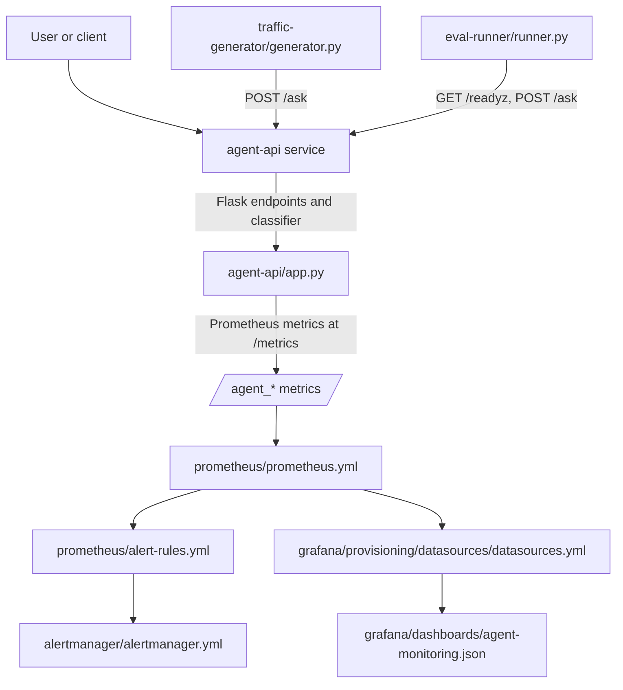
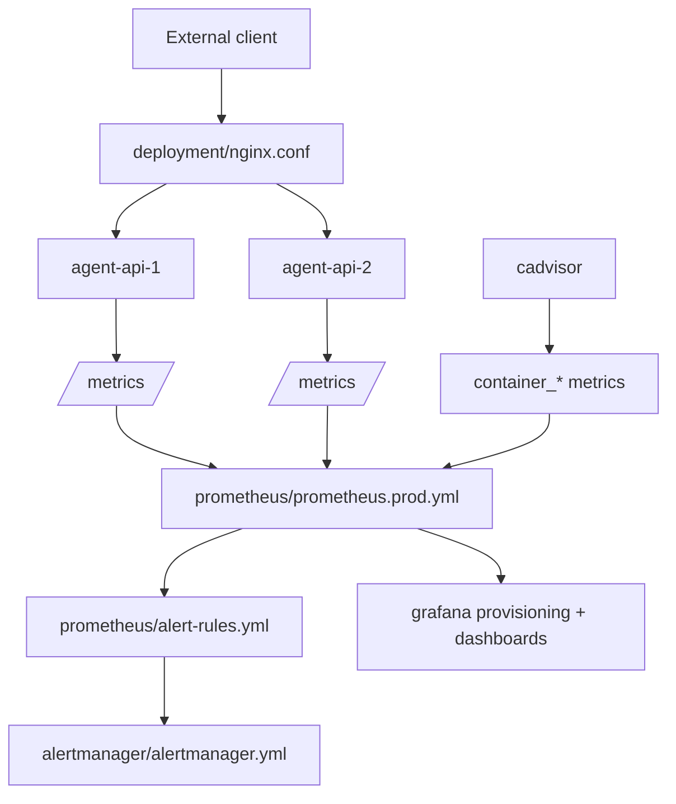

# File and Logic Relationship Schema

This repository models an LLM Agent API plus the local, monitoring, evaluation,
CI, and optional production deployment logic around it.

## Runtime Flow



## Production Flow



## File Relationship Map

| File or directory | Owns | Consumed by / related to |
| --- | --- | --- |
| `agent-api/app.py` | Flask app, `/ask`, health endpoints, `/metrics`, rejection rules, structured request logs, Prometheus metrics | `tests/test_agent_api.py`, `traffic-generator/generator.py`, `eval-runner/runner.py`, Prometheus configs, Grafana dashboard, alert rules |
| `agent-api/Dockerfile` | Runtime container for the API | `docker-compose.yml`, GitHub `build-image` job, `compose.prod.yml` via pushed image |
| `docker-compose.yml` | Local stack topology: API, traffic generator, Prometheus, Alertmanager, Grafana, on-demand eval runner | `Makefile`, CI integration eval, local development |
| `compose.prod.yml` | Production Docker VM topology: Nginx, two API replicas, Prometheus, Alertmanager, Grafana, cAdvisor | `deployment/scripts/deploy-docker-vm.sh`, `deployment/example.env`, CI config validation |
| `deployment/nginx.conf` | Production request routing, `/ask` rate limit, request-id forwarding, health and metrics proxying | `compose.prod.yml`, deployment bundle |
| `traffic-generator/generator.py` | Continuous synthetic traffic with configurable rejection mix | `docker-compose.yml`, Prometheus metrics population, Grafana demos |
| `eval-runner/runner.py` | Golden/adversarial HTTP evaluation gate and result JSON generation | `docker-compose.yml` eval profile, `Makefile eval`, CI integration eval, canary eval |
| `tests/test_agent_api.py` | Direct unit coverage for classifier, request validation, response shape, health, metrics, logging | `agent-api/app.py`, `pyproject.toml` pytest coverage settings |
| `prometheus/prometheus.yml` | Local scrape config and external labels | `docker-compose.yml`, `prometheus/alert-rules.yml`, Grafana |
| `prometheus/prometheus.prod.yml` | Production scrape config for API replicas and cAdvisor | `compose.prod.yml`, `prometheus/alert-rules.yml`, Grafana |
| `prometheus/alert-rules.yml` | Availability, SLO burn, error, latency, rejection, and saturation alerts | Prometheus configs, Alertmanager routes, Grafana dashboard URLs, `docs/incident-response.md` |
| `alertmanager/alertmanager.yml` | Alert grouping, severity/team routing, inhibition, receiver names | Prometheus alerting config, local/prod Compose stacks |
| `grafana/provisioning/datasources/datasources.yml` | Grafana datasource named `Prometheus` at `http://prometheus:9090` | Grafana container, dashboard queries |
| `grafana/provisioning/dashboards/dashboards.yml` | File-based dashboard loading from `/var/lib/grafana/dashboards` | Grafana container |
| `grafana/dashboards/agent-monitoring.json` | Panels for API request rate, rejections, latency, errors, invalid requests, and related metrics | Grafana provisioning, alert annotations, dashboard validator |
| `scripts/validate_grafana_dashboards.py` | Dashboard structural checks and known `agent_*` metric-name validation | `Makefile validate-config`, CI config validation, `agent-api/app.py` metric names |
| `docs/incident-response.md` | Runbook targets for alert annotations | `prometheus/alert-rules.yml`, deployment manifest |
| `Makefile` | Local command facade for build, run, test, security, config validation, eval, cleanup | Developer workflow, CI integration commands |
| `pyproject.toml` | Ruff, mypy, pytest, coverage, Bandit settings | `Makefile`, CI code-quality/unit/security jobs |
| `.github/workflows/ci.yml` | PR quality gates, integration eval, image build, metadata artifact, optional deploy/canary/rollback | Makefile targets, deployment scripts, Compose files, Prometheus/Grafana validation |
| `deployment/scripts/render-deployment-manifest.sh` | Release manifest artifact from CI/env metadata | CI `deployment-metadata` job, `deployment/manifest.yml` contract |
| `deployment/scripts/deploy-docker-vm.sh` | Bundles prod Compose/config/dashboard files, writes `.env`, deploys release symlink, verifies `/readyz` and `/metrics` | CI staging/production deploy jobs, `compose.prod.yml` |
| `deployment/scripts/rollback-docker-vm.sh` | Moves release symlink back to target/previous release and verifies health/metrics | CI workflow_dispatch rollback |
| `deployment/example.env` | Safe local example values for validating prod Compose | `Makefile validate-prod-config`, CI config validation |

## Core Logic Contracts

### Request and classification contract

`agent-api/app.py` is the source of truth for request behavior.

1. `/ask` increments `agent_requests_total`.
2. It validates JSON and `message`.
3. Invalid input records `agent_invalid_requests_total` and
   `agent_request_outcomes_total` with outcome `invalid_request`.
4. Valid input runs `classify_rejection(message)` against
   `REJECTION_PATTERNS`.
5. Rejected input records `agent_rejections_total`, classification latency,
   message length, request latency, and outcome `rejected`.
6. Accepted input runs `generate_response(message)` and records generation
   latency plus outcome `accepted`.

If rejection categories or patterns change, update:

- `tests/test_agent_api.py`
- `traffic-generator/generator.py`
- `eval-runner/runner.py`
- README rejection docs, if exposed to users
- Grafana panels or alert rules if dashboards depend on reason distribution

### Metrics and dashboard contract

`agent-api/app.py` emits the `agent_*` metric names. Those names are consumed by:

- `prometheus/alert-rules.yml`
- `grafana/dashboards/agent-monitoring.json`
- `scripts/validate_grafana_dashboards.py`
- README metrics docs

When a metric is added, renamed, or removed, update all consumers together. The
dashboard validator has an explicit `KNOWN_AGENT_METRICS` set, so new app
metrics used in Grafana must be added there.

### Health contract

The health endpoints are shared control points:

- `/readyz` is used by Docker healthchecks, traffic generator startup,
  eval-runner startup, CI integration checks, deploy verification, and rollback
  verification.
- `/livez` and `/healthz` are compatibility/process health endpoints.
- `/metrics` is used by Prometheus and production deploy/rollback verification.

Changing these paths requires coordinated updates in Compose files, Nginx,
traffic generator, eval runner, Makefile smoke checks, CI, and deployment
scripts.

### Versioning contract

`PROMPT_VERSION` and `CLASSIFIER_RULES_VERSION` flow through the system:

```text
Compose / CI / deployment env
  -> agent-api/app.py
  -> API responses + structured logs + version info metrics
  -> eval result JSON + dashboards/alerts by metric labels
  -> deployment manifest metadata
```

These variables let dashboards and eval artifacts tie behavior changes to a
prompt or classifier rollout.

### Alert routing contract

`prometheus/alert-rules.yml` assigns `severity`, `team`, and `environment`
labels. `alertmanager/alertmanager.yml` routes on `severity` and `team`, while
`environment` comes from Prometheus `external_labels`.

The same alert rule file is used locally and in production. Local and production
Prometheus files differ mainly in scrape targets and `external_labels`.

### Deployment contract

The optional Docker VM deployment path is:

```text
.github/workflows/ci.yml
  -> quality-gate
  -> build-image pushes GHCR digest
  -> render-deployment-manifest.sh records release metadata
  -> deploy-docker-vm.sh ships prod config bundle and starts compose.prod.yml
  -> canary eval gates production deploy
  -> rollback-docker-vm.sh restores a previous release when requested
```

`deploy-docker-vm.sh` bundles only production runtime/config assets, not source
tests. If production config files are added, make sure they are included in that
bundle.

## Change Impact Cheat Sheet

| Change | Update with it |
| --- | --- |
| New rejection reason | `agent-api/app.py`, unit tests, traffic generator, eval runner, README, dashboards/alerts if reason panels or alerts matter |
| New API route | Flask route, tests, Compose/Nginx if exposed, metrics labels, dashboards/alerts if monitored |
| Metric rename/removal | App metric definitions, alert rules, Grafana dashboard JSON, dashboard validator, README |
| New Grafana panel using `agent_*` metric | Dashboard JSON and `scripts/validate_grafana_dashboards.py` known metric list |
| Production scrape target change | `compose.prod.yml`, `prometheus/prometheus.prod.yml`, deployment bundle if new config files are needed |
| Health endpoint behavior/path change | API, Docker healthchecks, traffic/eval startup, Makefile smoke commands, CI checks, deploy/rollback scripts |
| Deployment metadata change | `deployment/manifest.yml`, render script, CI metadata job, README deployment docs |
